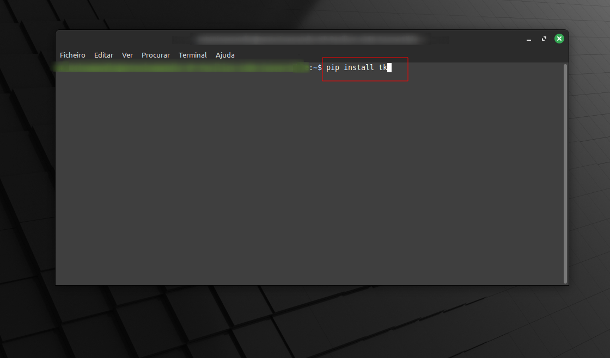
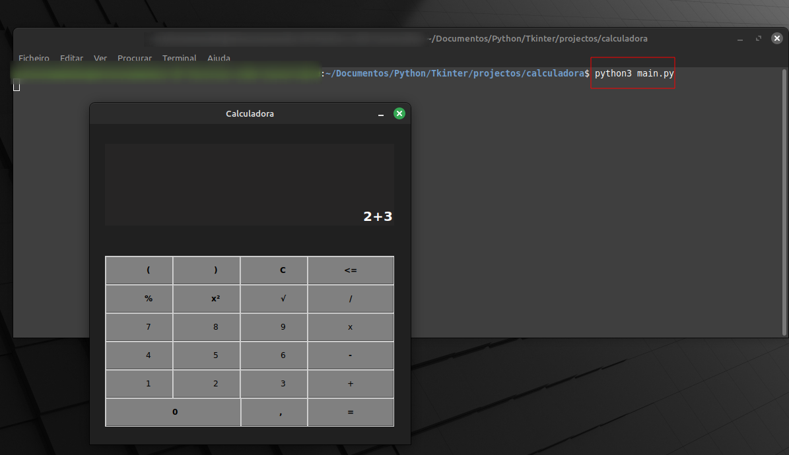

# DESCRIÇÃO EM PORTUGUÊS 🌍
    
Calculadora criada em Python utilizando como base a biblioteca Tkinter, que é uma biblioteca de interface gráfica do Python.

Então para poder testar o script tem que ter o Python instalado na sua máquina. Para instalar o Python basta acessar a URL "<a href="https://www.python.org/downloads" target="_blank">https://www.python.org/downloads/</a>" pelo seu navegador de preferência e fazer o download do Python na versão estável de sua preferência. A minha recomendação é que a versão do Python que desejar baixar e instalar não seja abaixo da versão "3.10".

    
Para instalar a biblioteca Tkinter utiliza-se o "pip", que é um gerenciador de pacotes do Python. O comando para instalar a biblioteca é o "pip install tk" ou "pip install Everything-Tkinter". Esses comandos devem ser digitados no prompt de comandos do seu sistema operacional.

Para executar esse ficheiro, basta baixar a pasta "src" deste repositório e localizar actravés do prompt de comandos o ficheiro "main.py", logo em seguida digitar "python main.py" ou "python3 main.py" (se estiver usando linux).

# DESCRIPTION IN ENGLISH 🌍

Calculator created in Python using the Tkinter library as a base, which is a Python graphical interface library.

So to be able to test the script you must have Python installed on your machine. To install Python, simply access the URL "<a href="https://www.python.org/downloads" target="_blank">https://www.python.org/downloads/</a>" via your preferred browser and download Python in the stable version of your choice. My recommendation is that the version of Python you want to download and install is not below version "3.10".
    
To install the Tkinter library, "pip" is used, which is a Python package manager. The command to install the library is "pip install tk" or "pip install Everything-Tkinter". These commands must be typed at your operating system's command prompt.

To run this file, simply download the "src" folder from this repository and locate the "main.py" file through the command prompt, then type "python main.py" or "python3 main.py" (if you are using Linux).